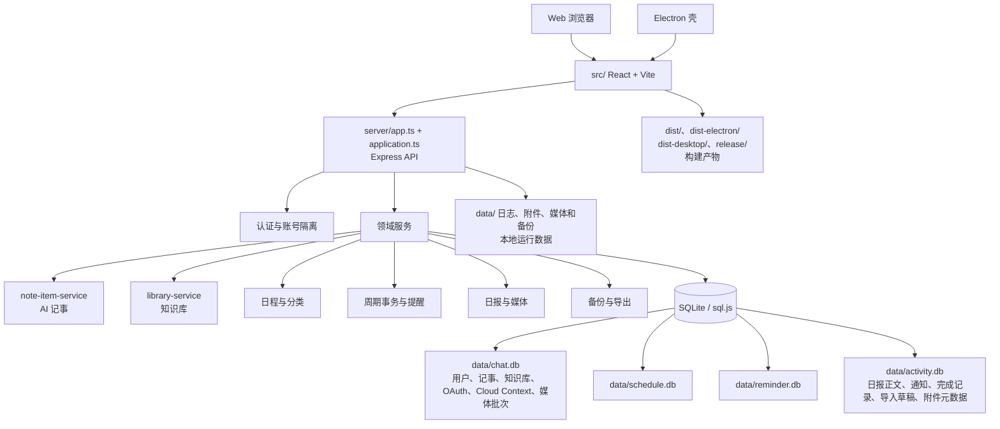
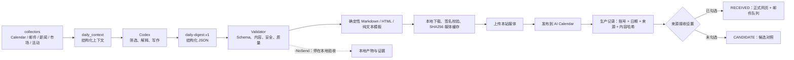

# AI Calendar 跨项目地图

- Status: LIVING
- Scope: 本文列明的源码结构、合同或验证方法；历史证据按时点使用。
- Last verified commit/version: `375469e` + Phase 5 CSS/验证收尾 / `0.21.4-260916.0715`（2026-09-16，本地源码；其他领域以各节证据为准）。
- Authority: 当前源码与自动化验证优先；文档职责见文档索引。
- Update trigger: 本领域 API、数据归属、媒体策略或验收入口变化。
- Supersedes: 原文中已纠正的漂移描述；保留历史快照时间边界。
- Do not use for: 推断当前生产部署、Work 配置或邮件收件箱状态。

本文档是 AI Calendar 主仓库与个人情报日报 V2 的逻辑地图。它只记录可提交的模块、边界和验证入口，不记录绝对个人路径、用户数据、令牌、授权码或运行机器上的真实配置。

## 1. 项目与边界

| 逻辑项目名 | 仓库范围 | 当前定位 | 允许的关系 |
| --- | --- | --- | --- |
| AI Calendar | `smart-schedule-agent/` | 主应用：Web、Electron、Express API、日程、提醒、账户和日报服务端 | 接收 V2 的已校验日报发布与媒体上传；按账号隔离保存 |
| 个人情报日报 V2 | `日报-v2/` | 当前日报采集、结构化生成、校验、媒体本地化和发布程序 | 通过只读/发布专用接口与 AI Calendar 交互；默认本地 `-NoSend` 验收 |
| `LEGACY_PROJECT` | `旧版日报/` | 只读参考与可恢复回滚边界 | 不修改代码、Prompt、配置、产物、邮件投递或定时任务 |

### 1.1 主仓库结构



主应用的四个数据库文件属于运行态数据，不能从生产机器回填到仓库。`dist/`、`dist-electron/`、`dist-desktop/` 和 `release/` 是构建/打包产物；源码、测试和文档属于提交边界。

### 1.2 日报 V2 Local 流程



模型只产生结构化内容；Markdown、HTML、纯文本、图片路径、生产日报记录、邮件队列和归档由确定性程序负责。媒体校验或上传失败时，不执行最后的日报发布。旧六章日报仍走受限 Markdown 兼容路径。

上述媒体失败阻断规则属于 Local 链路。Cloud 由服务端受控获取媒体：无 `mediaBatchId` 时逐图 Best Effort，有批次时保持 READY、归属和完整性检查。正文完整性均为硬闸门。Cloud `dry_run=true` 不保存日报、不入邮件队列，但兼容媒体处理可能写入托管文件。当前合同与历史运行记录见 [Cloud 文档](docs/CHATGPT-WORK-CLOUD.md)，文档导航见 [索引](docs/README.md)。

## 2. 跨项目 API 与安全边界

| 接口/页面 | 调用方 | 作用 | 边界 |
| --- | --- | --- | --- |
| `/api/integrations/daily-report/agenda` | V2 collector | 按显式日期读取当前账号日程 | Bearer 只读令牌、按账号隔离，不允许写入 |
| `/api/integrations/daily-report/mail` | V2 mail collector | 读取当前账号 QQ 未读邮件摘要 | 只返回摘要，不返回授权码，不改变已读状态 |
| `/api/integrations/daily-report/reports/:date/media/:filename` | V2 publisher | 上传本地已校验的新闻图或来源 logo | 令牌鉴权；文件名为内容 SHA256；服务端不访问外站 |
| `/api/integrations/daily-report/reports/:date` | V2 publisher | 创建或幂等更新本地来源日报 | 服务端固定 `source=local`；只接受合法结构与本站媒体引用；按账号、日期、来源和内容版本处理 |
| `/mcp` 的 `daily_report.publish` | Work Cloud | Shadow 校验或正式发布 Cloud 日报 | OAuth scope；服务端固定 `source=cloud`；`dry_run=true` 只返回 `VALIDATED_NOT_PUBLISHED`，`false` 返回 `PUBLISHED` 并写入生产记录 |
| `/api/daily-report/delivery-policy` | 登录用户 | 读取/保存本地与 Cloud 来源接收设置 | 只影响下一次正式发布后的网页和邮件接收；不暂停任务，不删除候选或历史 |
| `/api/daily-reports`、`/reports/:date` | 登录用户 | 查看正式日报、候选对照和来源日期详情 | 登录态、当前账号隔离；正式列表与候选视图分开；同日 Local/Cloud 可切换对照 |
| `/api/note-items` | 登录用户 | AI 记事 CRUD、颜色、完成/恢复和导出所需数据 | JWT 身份与 `user_id` 所有权；颜色只允许预设枚举 |
| `/api/library`、`/library` | 登录用户 | Fragment/Article 列表、搜索、阅读、评论和导出 | 当前账号隔离；正文、类型、标签和关系只读；Markdown 由服务端安全渲染 |
| `/api/integrations/library` 及生命周期子路径 | 本地 Markdown 迁移脚本 | 使用独立 Knowledge Publish Token 执行 `publish/retire/restore/purge` | 只保存 token 哈希；`sourceId + user_id` 定位文章；不拥有登录、读取列表、评论、日程或记事权限 |
| `/api/ai-chat` | 登录用户 | 普通问答、天气和待确认计划 | 普通对话可生成计划，但计划写入仍需用户确认；旧专用 `create_todo` 参数拒绝 |
| `/api/ai-linkage-guides` | 登录用户 | 读取版本化接入方法、联动规则和示例提示词 | 只读稳定内容；不返回密钥、动态日程上下文或运行时敏感信息 |

凭据分界：账号级设置和日报令牌只在各自的网页/忽略配置中保存；Prompt、日报、日志、Git 和可读导出均不包含凭据。生产邮件的 SMTP 接受、通知状态或网页状态都不等同于收件箱到达。

## 3. 外部依赖与责任归属

| 依赖 | 使用位置 | 失败/授权责任 |
| --- | --- | --- |
| CodeBuddy Agent SDK / Codex CLI | 主应用 AI、V2 结构化生成 | 只处理必要的结构化输入；模型失败不能绕过确认或 Validator |
| Open-Meteo | 主应用天气与 V2 相关上下文 | 网络/地点失败必须显式表示，不伪造天气 |
| QQ IMAP | 用户 QQ 未读邮件摘要 | 单独授权码、只读摘要、按账号隔离 |
| 163 SMTP | AI Calendar 官方通知与回滚投递 | 仅报告传输层结果；最终到达需收件箱证据 |
| 阿里云 OSS | 可选加密备份离机保存 | 私有 Bucket、最小权限；不把备份凭据放进仓库 |
| PM2 / Nginx / HTTPS | AI Calendar 生产运行 | 只按 `DEPLOY.md` 的预构建、备份、原子切换和健康检查流程执行 |

## 4. 任务路由与源码入口

| 任务 | 首先查看 | 不应越过的边界 |
| --- | --- | --- |
| 日记/记事板 UI、快捷键、导出 | `src/components/NoteBoard.tsx`、`src/components/AiSchedulePanel.tsx`、`src/utils/note-export.ts` | 不让 LLM 负责布局；导出在前端确定性生成 |
| 记事数据、迁移、备份恢复 | `server/note-item-service.ts`、`server/database/`（兼容入口 `db.ts`）、`server/backup-service.ts` | 保留旧 `linked_schedule_ids` 兼容字段；不跨账号读取 |
| 知识库、Markdown 迁移 | `server/library-service.ts`、`server/library-markdown.ts`、独立 Knowledge Library 项目的 `scripts/process-migration-folder.ps1`、`docs/knowledge-library-operations.md` | 普通处理校验通过后默认 `publish`；`retire/restore/purge` 必须显式选择；本地关系和正文清理后再通过令牌写入；不直接修改运行中的数据库 |
| AI 计划确认 | `server/routes/ai.ts`、`server/ai-plan.ts`、`server/operation-service.ts` | 先生成待确认草稿；确认结果与正式写入一起持久化；禁止旧专用入口自动完成来源记事 |
| 日报采集/生成/校验 | `日报-v2/scripts/`、`日报-v2/schemas/`、`日报-v2/tests/` | V2 只输出结构化内容；`-NoSend` 不发布、不入队、不发信 |
| 日报媒体与发布 | `日报-v2/scripts/report_media.py`、`日报-v2/scripts/publish_report.py`、主仓库 `server/daily-report*.ts` | Local 先本地校验/上传媒体再 PUT；Cloud 按兼容/严格批次合同处理媒体；正式发布均先写记录，再按来源设置进入网页/邮件 |
| 生产升级与回滚 | `DEPLOY.md`、`日报-v2/README.md` | 本地构建/验收与生产部署、真实 SMTP、收件箱验收分开授权和记录 |
| Knowledge Library 首次部署与文档追踪 | `docs/KNOWLEDGE-LIBRARY-FIRST-DEPLOYMENT.md`、独立 Knowledge Library 项目的 `docs/knowledge-library-first-deployment.md` | 本地批次、关系和生命周期先校验；不把令牌写入命令行、报告、日志或 Git |
| 旧日报问题 | `LEGACY_PROJECT` 只读副本 | 仅用于理解和回滚，不修改旧项目 |

## 5. 验证与证据

### AI Calendar

```text
npm run typecheck
npm test
npm run build
npm run test:cross-project
git diff --check
```

涉及 UI 时，还要在实际浏览器检查桌面与窄屏 viewport、长文本、三位数编号、暗色主题、抽屉、调色板、知识库 Markdown/表格/评论、下载和无横向溢出。涉及生产时，另行检查预构建包 SHA256、备份、原子切换、PM2、`/api/health`、静态 JS MIME/大小/连续请求和页面行为。

### 日报 V2

```text
python -m unittest discover -s tests -v
python -m compileall scripts tests
pwsh -NoProfile -File scripts/run_daily.ps1 -Date YYYY-MM-DD -NoSend
```

`-NoSend` 的产物和 Validator 是本地证据；Cloud `dry_run=true` 的 `VALIDATED_NOT_PUBLISHED`、正式接口的 `PUBLISHED`、通知队列、SMTP accepted 和收件箱到达分别属于不同验收层，不能相互替代。跨项目检查必须分别查看两个仓库的 `git status`、`git diff`、敏感信息扫描和版本/记录文件。
